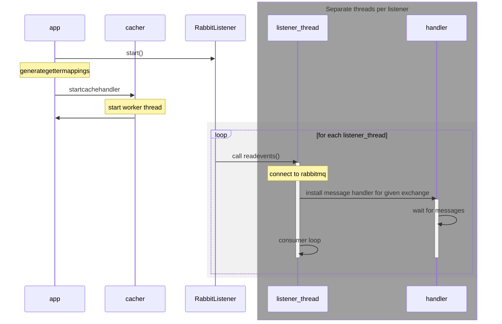
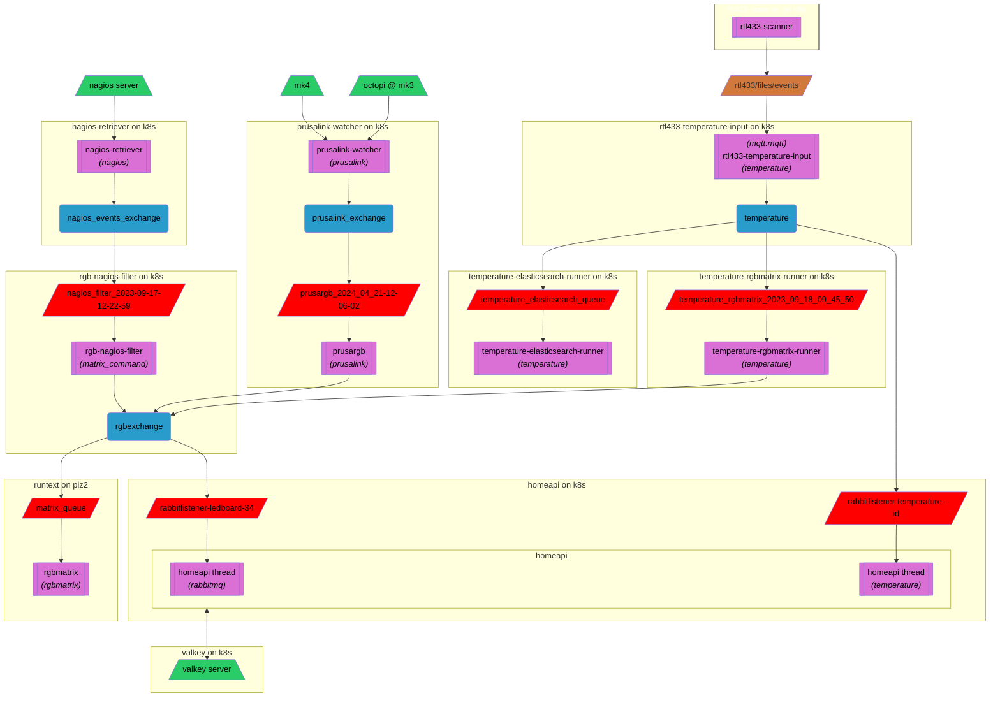

## RabbitListener overall structure

```mermaid
sequenceDiagram
    participant app
    participant cacher
    participant RabbitListener
    participant listener_thread
    box rgba(100, 100, 100, 0.5) Separate threads per listener

        participant listener_thread
        participant handler
    end

    
        
    app ->> RabbitListener: start()

    note over app: generategettermappings

    app ->> cacher: startcachehandler

    note over cacher: start worker thread

    cacher ->> app: 

    rect rgba(120, 120, 120, 0.1)
        loop for each listener_thread
            RabbitListener ->> listener_thread: call readevents()
            activate listener_thread
            note over listener_thread: connect to rabbitmq

            listener_thread ->> handler: install message handler for given exchange

            activate handler

            handler ->> handler: wait for messages
            listener_thread ->> listener_thread: consumer loop

            deactivate handler
            deactivate listener_thread
        end
    end

    
```

Queues and exchanges for led board:

```mermaid
flowchart TB

    classDef script fill:#da70d6,color:#000;
    classDef server fill:#2acc68ff,color:#000;
    classDef exchange fill:#2a9ccc,color:#000;
    classDef queue fill:#ff0000,color:#000;
    classDef mqtt fill:#d1783dff;
    style box color:#fff,stroke:#000;


    
    nagios_server[/nagios server\]:::server --> nagios_retriever[["`nagios-retriever
    *(nagios)*`"]]

    mk4[/mk4\]:::server --> watcher
    mk3[/octopi @ mk3\]:::server --> watcher

    subgraph retriever[nagios-retriever on k8s]
        nagios_retriever:::script --> nagios_events_exchange(nagios_events_exchange):::exchange
    end

    subgraph filter[rgb-nagios-filter on k8s]
        nagios_filter_queue[/nagios_filter_2023-09-17-12-22-59/]:::queue --> nagios_filter[["`rgb-nagios-filter
        *(matrix_command)*`"]]
        nagios_filter:::script --> rgbexchange(rgbexchange):::exchange
    end

    watcher[["`prusalink-watcher
        *(prusalink)*`"]]
    subgraph prusalinkwatcher[prusalink-watcher on k8s]
        watcher:::script --> prusalinkexchange(prusalink_exchange):::exchange

        prusalinkexchange --> prusargbqueue[/prusargb_2024_04_21-12-06-02/]:::queue
        
        prusargbqueue --> prusargb[["`prusargb
        *(prusalink)*`"]]
        prusargb:::script

        prusargb --> rgbexchange
    end


    temperature --> rabbitlistener_temperature
    rgbexchange --> rabbitlistener_ledboard

    subgraph homeapi_deployment[homeapi on k8s]
        rabbitlistener_ledboard[/rabbitlistener-ledboard-34/]:::queue --> homeapi1

        rabbitlistener_temperature[/rabbitlistener-temperature-id/]:::queue --> homeapi2

        subgraph homeapi
            homeapi1[["`homeapi thread
                *(rabbitmq)*`"]]:::script
            homeapi2[["`homeapi thread
                *(temperature)*`"]]:::script
        end
    end

    subgraph valkey[valkey on k8s]
        valkey_server[/valkey server\]:::server
    end

    homeapi <--> valkey_server

    nagios_events_exchange --> nagios_filter_queue

    subgraph runtext[runtext on piz2]
        matrix_queue[/matrix_queue/]:::queue --> rgbmatrix[["`rgbmatrix
        *(rgbmatrix)*`"]]:::script
    end

    rgbexchange --> matrix_queue

    rtl433_mqtt[/rtl433/files/events/]:::mqtt --> temperature_input
    rtl433_scanner:::script --> rtl433_mqtt

    subgraph box[rtl433-scanner on k8s]
        rtl433_scanner[["`rtl433-scanner`"]]:::script
    end

    subgraph rtl433_input[ rtl433-temperature-input on k8s]
        temperature_input[["`*(mqtt:mqtt)*
        rtl433-temperature-input
        *(temperature)*`"]]:::script --> temperature(temperature):::exchange
    end

    temperature --> temperature_matrix_queue:::queue

    subgraph temperature_matrix[ temperature-rgbmatrix-runner on k8s]
        temperature_matrix_queue[/temperature_rgbmatrix_2023_09_18_09_45_50/]:::queue --> temperature_rgbmatrix[["`temperature#8209;rgbmatrix#8209;runner
        *(temperature)*`"]]:::script
    end

    temperature_rgbmatrix --> rgbexchange

    temperature --> temperature_elastic_queue
    subgraph elasticsearch_runner[ temperature-elasticsearch-runner on k8s]
        temperature_elastic_queue[/temperature_elasticsearch_queue/]:::queue --> raw_elasticsearch[["`temperature#8209;elasticsearch#8209;runner
        *(temperature)*`"]]:::script
    end

```